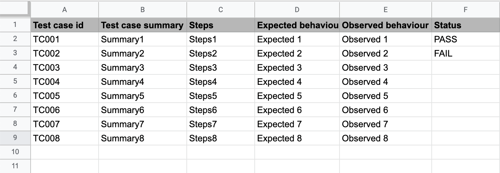

# googleSheets-Test-Reporting
Update test reports in google sheets. For java based (selenium, appium etc.) automation scripts

### Setup
1. Add the following lines to build.gradle:
```
repositories {
    mavenCentral()
}

dependencies {
    compile 'com.google.api-client:google-api-client:1.30.4'
    compile 'com.google.oauth-client:google-oauth-client-jetty:1.30.6'
    compile 'com.google.apis:google-api-services-sheets:v4-rev581-1.25.0'
}
```
2. Navigate to https://developers.google.com/sheets/api/quickstart/java and enable google sheets API. Download the credentials.json generated to src/main/resources/ directory in the project.
3. Ensure that the sharing permission of the target test report in google sheets is set to "Anyone on the internet with this link can edit".

4. From this repository, download and copy the files "Params.java" and "GoogleReport.java" into the project directory.
5. Edit the constant values Params.java class carefully, as per the target test report. (Note: Value of SPREADSHEETID can be found in the google sheets url e.g. https://docs.google.com/spreadsheets/d/**SPREADSHEETID**/edit#gid=0)

 ### Sample test report
 
 
 ### Sample test case
 ```
 import java.io.IOException;
import java.security.GeneralSecurityException;

public class TestSuite {
	GoogleReport googleReportObject = new GoogleReport();

	public testCase1() throws IOException, GeneralSecurityException {
		if (TestCondition == TRUE) {
			googleReportObject.updateReport("TC001", "PASS");
		} else {
			googleReportObject.updateReport("TC001", "FAIL");
		}
			
	}

}

 ```
